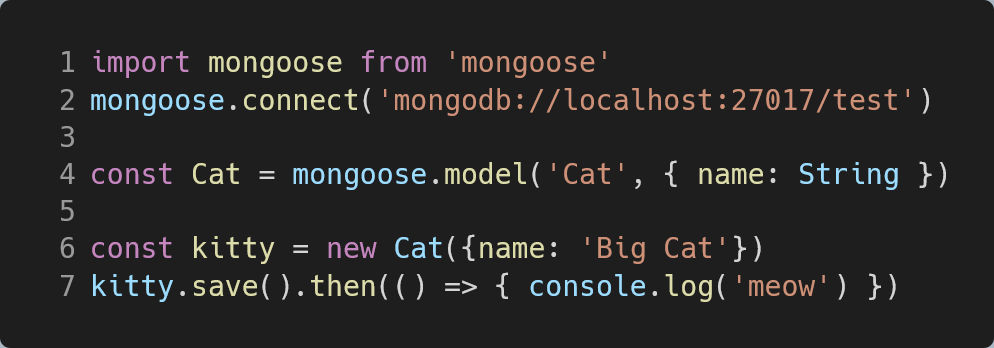

---

theme : "night"
transition: "slide"
highlightTheme: "monokai"
# logoImg: "logo.png"
slideNumber: true
title: "MERN Introduction"

---

### MERN Introduction

---

Yubin, Hsu

TSID / NTAP

ybhsu@tsmc.com

---

### Outline

- Web Application
  - 3-Tier Arch.
- MERN
  - What is MERN
  - MERN Arch.
  - MERN Component
  - Why MERN

---

### Web Application

--

not only a static website

---

### Web Application 3-Tier Arch.

- Frontend
- Backend
- Database

--

Frontend or Backend?

--

---

### What is MERN

--

A full-stack solution

---

### M.E.R.N. Component

- MongoDB - Database
- ~~Express~~ Fastify - Nodejs Web Framework
- React - client-side JavaScript library
- Node - JavaScript web server

--

### MERN Arch.

---

### React

- Open Source JavaScript Library
  - https://github.com/facebook/react
  - Maintained by Facebook
- Component-Based

--

--

Which of these frameworks would you like to keep on using or want to learn in the future?

https://tsh.io/state-of-frontend/

--

### Component-Based

- Build encapsulated component
  - Written in JavaScript instead of templates

--

---

### Node

--

- Node is a JavaScript runtime
  - Built on Chrome's V8 JavaScript engine
- Open Source
  - https://github.com/nodejs/node
- Cross Platform
  - Linux, Windows, MacOS, Docker Image, ...

--

--

Node Package Manager (NPM)

- Modules can be shared by packaging
- NPM is a package manager for node
  - Installed automatically with Node
  - Command Line Interface tool
  - Developer friendly
    - Manage all dependencies
    - Custom scripts

--

---

### Fastify

--

- Fast and low overhead web framework, for Node.js
- Highly performant

https://github.com/fastify/fastify

--

Define an endpoint example

--

Send a GET request to /ping

---

### MongoDB

--

Document Database

--

Schema Less

--

JavaScript Friendly
  - Use BSON internally

--

Issue of JSON for usage inside of a database

- JSON is a text-based format
  - Parsing slowly
- JSON's readable format is far from space efficient
- JSON only support a limited number of basic data types

--

BSON

- Binary JSON

- Developer use JSON as usual
https://subscription.packtpub.com/book/web_development/9781788624701/9/ch09lvl1sec53/json-versus-bson

---

### Mongoose

--

Mongoose is a MongoDB object modeling tool
  - Use official MongoDB driver as dependencies
  - Schema-Based

--

---

### Why MERN

--

JavaScript is popular

--

JavaScript Everywhere

--

JSON Everywhere

--

The npm Ecosystem

---

### If any question

--

--

---

### Weird JavaScript

--

--

https://www.freecodecamp.org/news/explaining-the-best-javascript-meme-i-have-ever-seen/

--

--

---

end